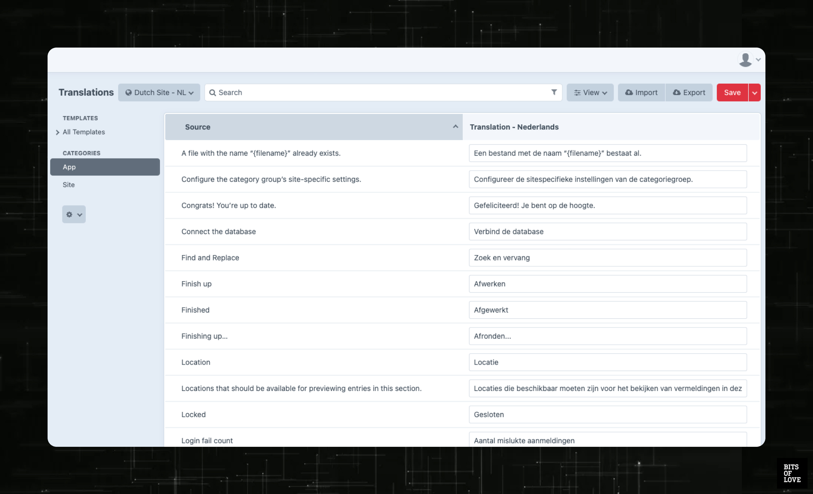

# Easy Translations

The Easy Translations plugin makes it easy to manage your site's static translations. With a clean overview of all used translations and support for Export/Import, you can quickly start translating all your sites! 



## Features
- Easily view and update all static translations.
- Summary off all static translations used in each file.
- Saved translations will be stored in the database. No conflict between development and client.
- Export translations to CSV, XML and JSON.
- Import translations using CSV.
- User rights to decide who can view what translations.
- Sorting and searching to quickly find specific translations.


## Usage

### Main Translation Table
The table on the main page of the plugin contains a list of all the sources (the keys) as defined in the static translation files.

Next to the sources, in the second column, you can see and edit the translations. What translations you manage depends on the selected language/site in the top left multi-site menu.

### Sidebar
Depending on the user's rights, different sections will be visible on the left of the main table.

#### Templates

A sorted list of all the template files containing one or more translation keys. This is particularly useful for developers, wanting to know exactly where a translation is being used.

#### Categories

Beneath the template paths, there's a list of categories. These include all the translations contained in static translation files such `app.php` and `site.php`.

### Translation Logic
By default the translations will first be extracted from the static translation files. Changing and saving some translations will result in **only** the altered translations to be saved to the database.

Translations saved in the database have priority over those in the static files. This means that admins/clients have full control over static translations without having to alter any file or code. 

## System Requirements

- Craft 3

## Installation

To install this plugin, go to your Craft project and follow the instructions below.

- Load the plugin via Composer:
```shell
composer require bitsoflove/craft-easy-translations -w
```
- Install the plugin in the Control Panel -> Settings -> Plugins. **Or** use the following command:
```shell
php craft plugin/install easy-translations
```
